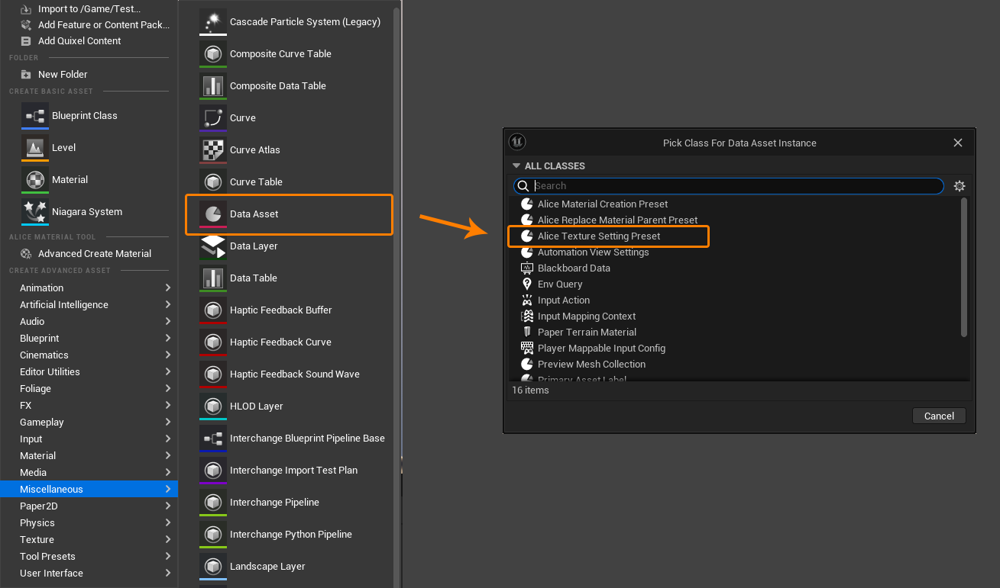

# Alice Material Tool Installation

1. Open the editor's and click top right corner Settings.
2. Open the Plugins panel.
3. Search for "Alice Material Tool."
4. Enable the Alice Material Tool plugin.

# Merge Textures

The Merge Textures tool is used to combine up to four different Texture2D texture channels into a new Texture2D texture asset.

## Merge Texture - Editor Tool

Select any Texture2D asset in the content browser, right-click to open the asset context menu, and you can find the Merge Textures tool button.

### Tool Interface

Click the "Merge Textures" button to enter the Merge Textures operation. At this point, a settings dialog box will pop up, and its UI looks like this:

1. **Path Picker** 
   The Path Picker is used to select the folder path for the new Texture2D asset. If the folder does not exist, you can create a new folder by right-clicking. When the Merge Textures operation is successful, the tool will automatically record the path used in this operation and attempt to select it as the default path the next time the tool is opened.

2. **Texture Channel Picker** 
   The Texture Channel Picker helps you select single channels from existing Texture2D textures and combine them into new RGBA channels. When you select a channel, the preview image on the right will update accordingly.

3. **Texture Setting** 
   The Texture Setting is used to set the properties of the new Texture2D asset.

   **Texture Size -** You can set the size of the new texture under the "Creation Setting" category by adjusting the "Texture Size." When the Merge Textures operation is successful, the tool will automatically record the Texture Size used in this operation and use it as the default value the next time the tool is opened. *Note: Using source textures of the same size as the new texture can maximize the retention of details from the source textures.

   **Texture Setting -** Under the "Texture Setting" category, the Texture Format will affect the creation format of the Texture2D source. For more information, refer to the "Texture Format" section later in the document.

   **Texture Setting Preset -** You can quickly set Texture Setting by switching presets. This is optional. For details on creating Texture Setting Presets, refer to the "Texture Setting Preset" section later in the document.

4. **Name Input Box** Here, you can enter the name of the new Texture2D asset.

5. **Message Box** When an operation does not meet the requirements, a message will be displayed here, and the "Create Texture" button at the bottom right will become grayed out and unavailable. When the Merge Textures tool is ready to create a new Texture2D asset, it will display brief information about the creation here, and the "Create Texture" button will turn blue and become available.

6. **Settings** After successfully creating the Texture2D asset, the Merge Textures tool allows users to perform some additional operations:

   - **Open texture editor -** Open the texture editor for the new Texture2D asset after creation.

   - **Save texture after creation -** Save the new Texture2D asset immediately after creation.
   - **Goto texture after creation -** Select the new Texture2D asset in the content browser after creation.

### Texture Channel Picker

When performing the Merge Textures operation, you can select multiple Texture2D textures at once. The Merge Textures tool will then sequentially place them into the RGBA channels of the texture based on the order of selection (any selected textures beyond the fourth will be discarded):

You can set the textures by **dragging and dropping** them directly from the content browser:

### Texture Format

Texture Format supports four different formats:

- If you want the new texture asset to store **a single channel (linear color space)**, you can use the "**RTF R8**" format.
- If you want the new texture asset to store **linear color space data**, you can use the "**RTF RGBA8**" format.
- If you want the new texture asset to store **sRGB color space data**, you can use the "**RTF RGBA8 SRGB**" format.
- If you want the new texture asset to store **16-bit linear color space data**, you can use the "**RTF RGBA16f**" format.

Since Unreal Engine samples all formats of textures into the linear color space for processing, the different formats of the source textures used for merging will not affect the output result.

*Because the sRGB color space applies gamma correction, if you output a linear color space texture as an sRGB color space texture, it will appear brighter than the original texture when sampled in the linear color space, but will match the original texture when sampled in the sRGB color space. Conversely, if you output an sRGB color space texture as a linear color space texture, it will match the original texture when sampled in the linear color space but will appear darker when sampled in the sRGB color space.*

### Texture Setting Preset

To create a Texture Setting Preset, right-click in the content browser and select Miscellaneous -> Data Asset, then choose "Alice Texture Setting Preset".

## Merge Texture - Blueprint Tool

You can invoke the same functionality as the Merge Textures tool in editor blueprints (non-runtime blueprints) to programmatically batch generate merged textures.

To use Merge Textures in editor blueprints, you can utilize the following nodes:

If the execution is successful, the "New Texture" output pin will provide a pointer to the newly generated texture. If the execution fails, the "New Texture" output pin will provide a null pointer. Regardless of success or failure, the "Message" output pin will provide the corresponding message.

# Advanced Create Material

The Advanced Create Material tool is used to automatically create a material instance asset from selected multiple textures.

When creating a material instance asset, the Advanced Create Material tool will examine the content to the right of the "_" separator at the end of the selected texture names, and identify it as the suffix of the texture's name. The tool will automatically set textures with the specified suffix to the TextureParameter specified in the Material Creation Preset, based on the settings provided.

## Advanced Create Material - Editor Tool

In the content browser, select any Texture2D asset, then right-click to open the asset context menu, where you can find the Advanced Create Material tool button.

### Tool Interface

Clicking the "Advanced Create Material" button will initiate the Advanced Create Material operation. At this point, a settings dialog will appear. This dialog is modal, meaning that during the Advanced Create Material operation, you won't be able to edit other content in the content browser until the new material instance asset is created or the operation is canceled. The UI of the settings dialog looks like this:

1. **Path Picker**: 
   The Path Picker is used to select the folder path for the newly created material instance asset. If the folder doesn't exist, you can create a new folder by right-clicking. When the Advanced Create Material operation is successful, the tool automatically records the path used for this creation operation and attempts to select this path as the default path the next time the tool is opened.

2. **Parent Material Picker**: 
   The Parent Material Picker is used to select the parent material for the newly created material instance asset. When the Advanced Create Material operation is successful, the tool automatically records the parent material used for this creation operation and attempts to select this parent material as the default parent material the next time the tool is opened.

3. **Material Creation Preset Picker**: 
   The Material Creation Preset Picker is used to select the Material Creation Preset for the newly created material instance asset. When the Advanced Create Material operation is successful, the tool automatically records the Material Creation Preset used for this creation operation and attempts to select this Material Creation Preset as the default preset the next time the tool is opened.

   The Material Creation Preset guides the Advanced Create Material tool on how to create a material instance using the selected textures. It's a mandatory item. For more detailed usage of the Material Creation Preset, please refer to the subsequent "Material Creation Preset" section in the documentation.

4. **Material Creation Preset View**: 
   The Material Creation Preset View previews the contents of the selected Material Creation Preset.

5. **Name Input Box**: 
   You can input the name for the newly created material instance asset here.

6. **Message Box**: 
   When the operation doesn't meet the requirements, a prompt message will be displayed here, and the "Create Material" button in the bottom right corner will become grayed out and disabled. When the Advanced Create Material tool is ready to create the new material instance asset, this section will display brief information about the creation process, and the "Create Material" button in the bottom right corner will become blue and enabled.

7. **Settings**: 
   After successfully creating the material instance asset, the Advanced Create Material tool allows users to perform some additional actions:

   - **Open material textures config panel -** After successfully creating the material instance asset, open the texture configuration panel for that asset.
   
   - **Save material after creation -** After successfully creating the material instance asset, immediately save that asset.
   
   - **Goto material after creation -** After successfully creating the material instance asset, select that asset in the content browser.

### Material Creation Preset

To create a Material Creation Preset, you can right-click in the content browser and select Miscellaneous -> Data Asset, then choose "Alice Material Creation Preset".

In the Material Creation Preset, you can set the "Target Material" corresponding to this Material Creation Preset. If it's empty, it indicates that this Material Creation Preset can correspond to all Materials.

The same "Texture Parameter Name" can correspond to multiple different texture suffixes. When a selected texture has a corresponding suffix (the content to the right of the "_" separator in the texture name), it will be assigned to the corresponding TextureParameter in the material. When there are multiple available textures, the one with a higher priority in the settings will be given precedence.

### Material Textures Config Panel

After the material instance is created, you can choose to open the material texture configuration panel.

The panel will list all selected textures and provide a window to configure the material TextureParameters, which can be useful for complex or special cases.

The panel also aims to provide a quick way to create materials even if you don't intend to follow any Material Creation Preset configurations.

The Material Textures Config Panel is a non-modal window. You can drag other textures that are not selected from the content browser to configure the newly generated material.

## Advanced Create Material - Blueprint Tool

You can invoke the same functionality as the Advanced Create Material tool in editor blueprints (non-runtime blueprints) to programmatically batch generate material instances.

To use Advanced Create Material in editor blueprints, you can utilize the following nodes:

If the execution is successful, the "New Material" output pin will provide a pointer to the newly generated material instance. If the execution fails, the "New Material" output pin will provide a null pointer. Regardless of success or failure, the "Message" output pin will provide the corresponding message.

# Advanced Replace Parent

Advanced Replace Parent is used to systematically replace the parent material of material instances while preserving the parameter settings of the instances as much as possible.

## Advanced Replace Parent - Editor Tool

In the content browser, select any material instance asset, then right-click to open the asset context menu, where you can find the Replace Parent tool button.

### Tool Interface

Clicking the "Replace Parent" button will initiate the Advanced Replace Parent operation. At this point, a settings dialog will appear. This dialog is modal, meaning that during the Advanced Replace Parent operation, you won't be able to edit other content in the content browser until the replacement of the parent material for the material instances is completed or the operation is canceled. The UI of the settings dialog looks like this:

1. **Parent Material Picker**: 
   The Parent Material Picker is used to select the new parent material. When the Advanced Replace Parent operation is successful, the tool automatically records the parent material used for this replacement operation and attempts to select this parent material as the default parent material the next time the tool is opened.

2. **Replace Material Parent Preset Picker**: 
   The Replace Material Parent Preset guides how to transfer parameters from the old parent material to the new parent material. When the Advanced Replace Parent operation is successful, the tool automatically records the Replace Material Parent Preset used for this operation and attempts to select this preset as the default preset the next time the tool is opened.

3. **Replace Material Parent Preset View**: 
   The Replace Material Parent Preset View previews the contents of the selected Replace Material Parent Preset.

4. **Message Box**: 
   When the operation doesn't meet the requirements, a prompt message will be displayed here, and the "Replace Parent" button in the bottom right corner will become grayed out and disabled. When the Advanced Replace Parent tool is ready to replace the parent material for the material instances, this section will display brief information about the replacement process, and the "Replace Parent" button in the bottom right corner will become blue and enabled.

5. **Settings**: 
   After successfully replacing the parent material for the material instances, the Advanced Replace Parent tool allows users to perform some additional actions:
   - **Save material after replace parent -** Save the material instance after replacing the parent material.

*You can select multiple material instance assets at once to perform the replacement operation. If the new parent material is the same as the current material instance or the parent material of the current material instance, the Advanced Replace Parent tool will skip the replacement operation for that material instance.*

### Replace Material Parent Preset

To create a Replace Material Parent Preset, you can right-click in the content browser, select Miscellaneous -> Data Asset, then choose "Alice Replace Material Parent Preset".

In the Replace Material Parent Preset, you can set pairs of names for the parameters of the old parent material and the new parent material. The Advanced Replace Parent tool will attempt to transfer parameters between the old and new materials based on these name pairs.

In principle, parameters from the old parent material can be transferred to different parameters of the new parent material repeatedly. Conversely, if multiple parameters from different old parent materials are transferred to the same parameter of the new parent material, the settings with higher priority will take precedence.

## Advanced Replace Parent - Blueprint Tool

You can invoke the same functionality as the Advanced Replace Parent tool in editor blueprints (non-runtime blueprints) to systematically replace the parent material of material instances.

To use Advanced Replace Parent in editor blueprints, you can utilize the following nodes:

If the execution is successful, the "Success" output will be true. If the execution fails, the "Success" output will be false. Regardless of success or failure, the "Message" output pin will provide the corresponding message.