# Alice Material Tool 安装

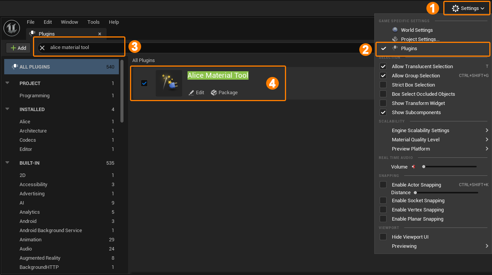

1. 打开编辑器右上角 Setting。
2. 打开 Plugins 面板。
3. 搜索“Alice Material Tool”。
4. 启用 Alice Material Tool 插件。

# Merge Textures

Merge Textures 工具用于将至多四个不同的 Texture2D 纹理通道组合为一个新的 Texture2D 纹理资产。

## Merge Texture - 编辑器工具

在内容浏览器中选择任意 Texture2D 资产，单击右键打开资产上下文菜单，可以找到 Merge Texture 工具按钮。

### 工具界面

点击“Merge Textures”按钮，将进入 Merge Textures 操作。此时会弹出一个设置对话框，它的UI看起来像下面这样：

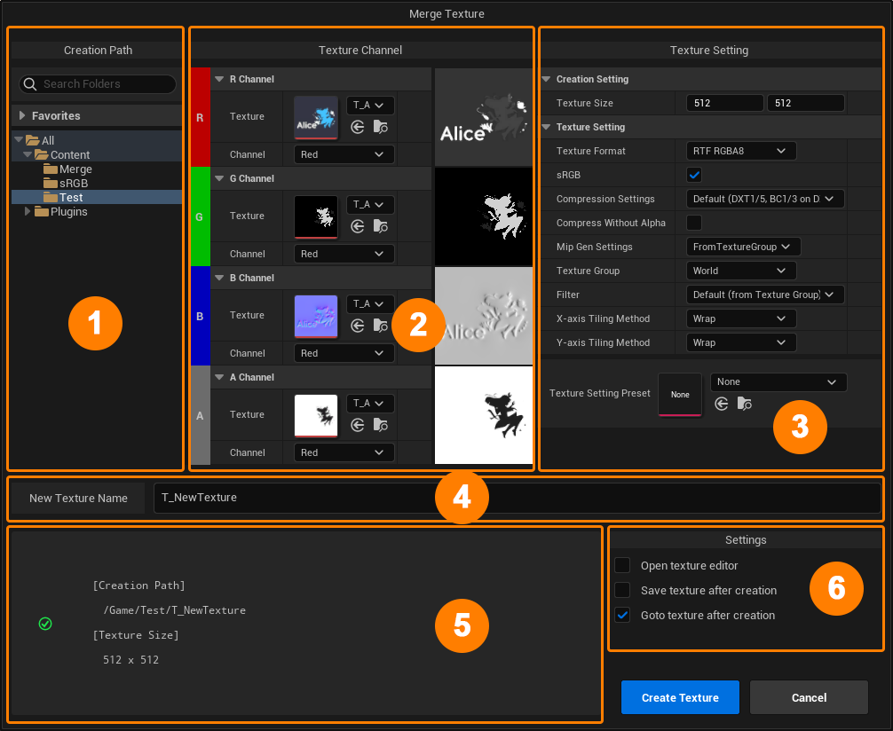

1. **Path Picker**
   Path Picker 用于选取新建 Texture2D 资产的文件夹路径，如果文件夹不存在，您可以通过单击右键的方式新建文件夹。当本次 Merge Textures 操作成功时，工具会自动记录这一次创建操作使用的路径，并在下一次打开工具后自动尝试选择该路径作为默认路径。

2. **Texture Channel Picker**
   Texture Channel Picker 帮助您从已存在 Texture2D 中选择单个通道，并将它们组合成新的 RGBA 通道。当您选择某个通道时，在右侧会更新该通道的预览图。

3. **Texture Setting**
   Texture Setting 用于设置新建 Texture2D 资产的属性。

   **Texture Size -** 您可以通过 “Creation Setting” 分类下的 “Texture Size” 来设置新建纹理的尺寸，当本次 Merge Textures 操作成功时，工具会自动记录这一次创建操作使用的 Texture Size，并在下一次打开工具后自动使用该 Texture Size 作为默认值。*注意，尽量采用与新建纹理尺寸相同的源纹理，可以最大限度地保持源纹理上的细节。

   **Texture Setting -** “Texture Setting” 分类下的设置里，Texture Format 将影响 Texture2D 源的创建格式，关于它的说明，可以查看文档后续 “Texture Format” 小节下的内容。

   **Texture Setting Preset -** 您可以通过切换预设，来达到快速设置 Texture Setting 的目的。这不是一个必选的内容。有关 Texture Setting Preset 的详细创建方式，可以查看文档后续 “Texture Setting Preset” 小节下的内容。

4. **Name Input Box**
   您可以在此处输入新建 Texture2D 资产的名称。

5. **Message Box**
   当操作不符合要求时，在此处会显示提示信息，此时右下角的 “Create Texture” 按钮将变成灰色的不可用状态。当 Merge Textures 工具已经准备好创建新的 Texture2D 资产时，此处将显示创建相关的简略信息，此时右下角的 “Create Texture” 按钮将变成蓝色的可用状态。

6. **Settings**
   在成功创建 Texture2D 资产后，Merge Textures 工具允许用户执行一些附加操作：

   - **Open texture editor -** 当成功创建 Texture2D 资产后，打开该资产的纹理编辑器。

   - **Save texture after creation -** 当成功创建 Texture2D 资产后，立即保存该资产。

   - **Goto texture after creation -** 当成功创建 Texture2D 资产后，在内容浏览器中选择该资产。

### Texture Channel Picker

在执行 Merge Textures 操作时，您可以一次性选择多个 Texture2D 纹理，此时 Merge Textures 工具将会按照纹理的选择顺序将它们依次放入 RGBA 通道的纹理中（超过四个的被选择纹理将会被丢弃）：

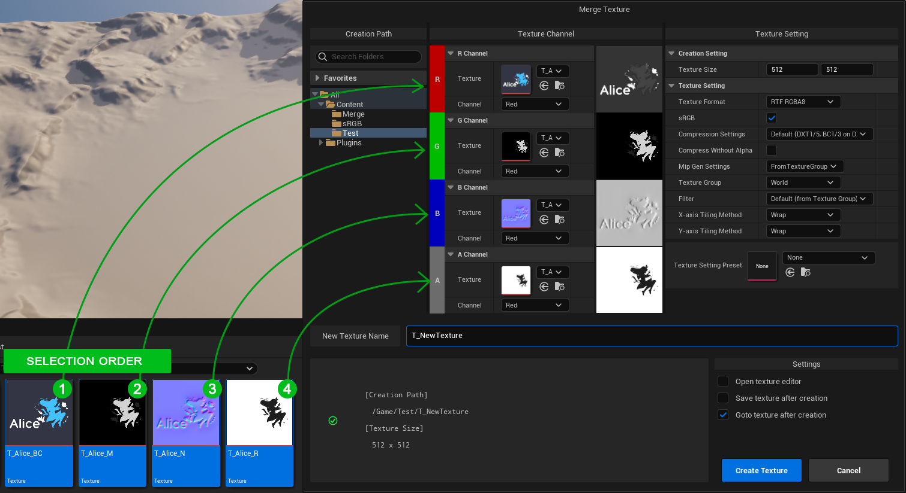

您可以通过直接从内容浏览器**拖拽**的方式设置纹理：

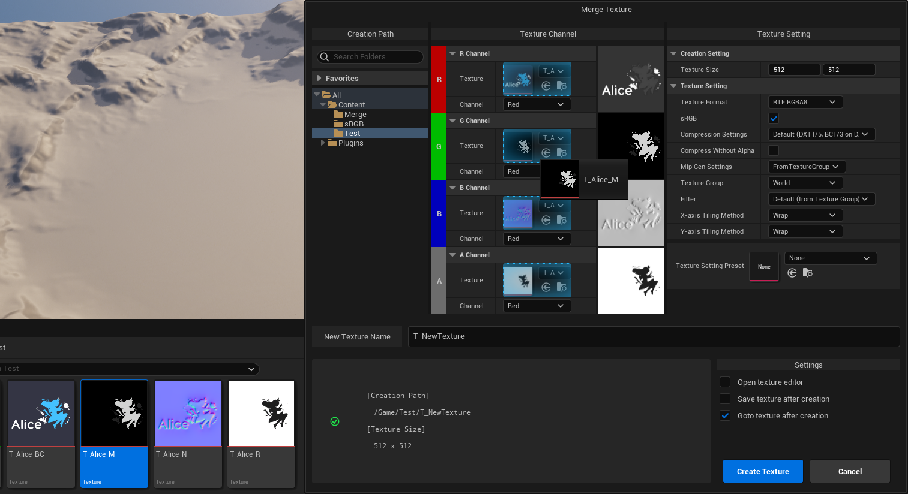

### Texture Format

Texture Format 支持四种不同的格式：

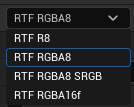

- 如果您希望让新的纹理资产只储存**单个通道（线性颜色空间）**，可以使用 “**RTF R8**” 格式。
- 如果您希望让新的纹理资产储存**线性颜色空间数据**，可以使用 “**RTF RGBA8**” 格式。
- 如果您希望让新的纹理资产储存**sRGB颜色空间数据**，可以使用 “**RTF RGBA8 SRGB**” 格式。
- 如果您希望让新的纹理资产储存**16位的线性颜色空间数据**，可以使用 “**RTF RGBA16f**” 格式。

由于 UnrealEngine 会将所有格式的纹理统一采样到线性颜色空间中计算处理，因此即使用于合并的源纹理格式不同，也不会对输出的结果造成影响。

*由于sRGB颜色空间会进行Gamma矫正，如果您将一个线性颜色空间的纹理输出为sRGB颜色空间纹理，它在线性颜色空间采样下看起来会变得比原纹理更亮，而在sRGB颜色空间采样下与原纹理保持一致。如果您将一个sRGB颜色空间的纹理输出为线性颜色空间纹理，它在线性颜色空间采样下会与原纹理保持一致，而在sRGB颜色空间采样下比原纹理更暗。*

### Texture Setting Preset

要创建 Texture Setting Preset，可以通过在内容浏览器中单击鼠标右键选择 Miscellaneous -> Data Asset，选择 “Alice Texture Setting Preset”。

## Merge Texture - 蓝图工具

您可以在编辑器蓝图（非运行时蓝图）中调用与 Merge Textures 工具相同的功能，以程式化地批量生成合并纹理。

要在编辑器蓝图中使用 Merge Textures，可以通过下面的节点：

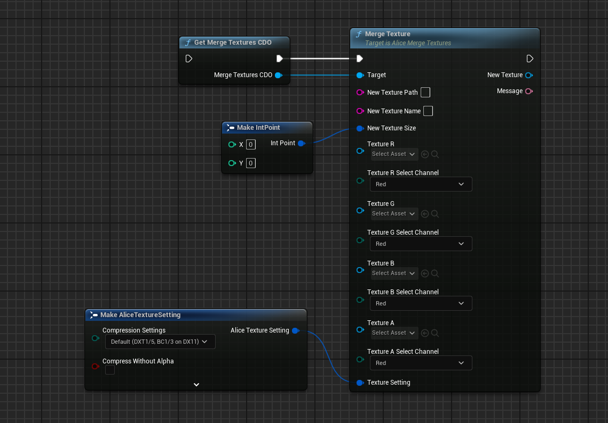

如果执行成功，“New Texture” 输出Pin将输出新生成的纹理指针，如果执行失败，“New Texture” 输出Pin将输出空指针。无论执行成功或者失败，Message 输出Pin都将输出与之相应的消息。

# Advanced Create Material

Advanced Create Material 工具用于将选定的多个纹理自动创建为一个材质实例资产。

在创建材质实例资产时，Advanced Create Material 工具将检查选定纹理名称的尾部以“_”分隔的右侧内容，并将其识别为该纹理的名称后缀，工具将根据 Material Creation Preset 中提供的设置，把具有指定后缀的纹理自动设置到材质中指定的 TextureParameter 上。

## Advanced Create Material - 编辑器工具

在内容浏览器中选择任意 Texture2D 资产，单击右键打开资产上下文菜单，可以找到 Advanced Create Material 工具按钮。

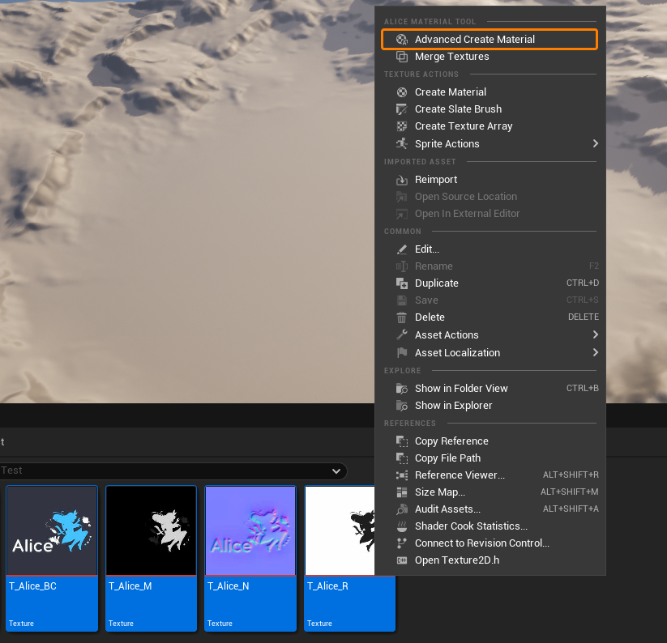

### 工具界面

点击“Advanced Create Material”按钮，将进入 Advanced Create Material 操作。此时会弹出一个设置对话框，该设置对话框是一个模态窗口，在进行 Advanced Create Material 操作的过程中，您将无法对内容浏览器中的其他内容进行编辑，直至新的材质实例资产被创建完成，或本次操作被取消。设置对话框的UI看起来像下面这样：

1. **Path Picker**
   Path Picker 用于选取新建材质实例资产的文件夹路径，如果文件夹不存在，您可以通过单击右键的方式新建文件夹。当本次 Advanced Create Material 操作成功时，工具会自动记录这一次创建操作使用的路径，并在下一次打开工具后自动尝试选择该路径作为默认路径。

2. **Parent Material Picker**
   Parent Material Picker 用于选取新建材质实例资产的父材质，当本次 Advanced Create Material 操作成功时，工具会自动记录这一次创建操作使用的父材质，并在下一次打开工具后自动尝试选择该父材质作为默认父材质。

3. **Material Creation Preset Picker**
   Material Creation Preset Picker 用于选取新建材质实例资产的 Material Creation Preset，当本次 Advanced Create Material 操作成功时，工具会自动记录这一次创建操作使用的 Material Creation Preset，并在下一次打开工具后自动尝试选择该 Material Creation Preset 作为默认 Preset。

   Material Creation Preset 用于指导 Advanced Create Material 工具如何使用选定的纹理创建材质实例，是一个必选项目，有关 Material Creation Preset 更详细的使用方法，可以查看文档后续 “Material Creation Preset” 小节。

4. **Material Creation Preset View**
   Material Creation Preset View 用于预览选定 Material Creation Preset 里的内容。

5. **Name Input Box**
   您可以在此处输入新建材质实例资产的名称。

6. **Message Box**
   当操作不符合要求时，在此处会显示提示信息，此时右下角的 “Create Material” 按钮将变成灰色的不可用状态。当 Advanced Create Material 工具已经准备好创建新的材质实例资产时，此处将显示创建相关的简略信息，此时右下角的 “Create Material” 按钮将变成蓝色的可用状态。

7. **Settings**
   在成功创建材质实例资产后，Advanced Create Material 工具允许用户执行一些附加操作：

   - **Open material textures config panel -** 当成功创建材质实例资产后，打开该资产的纹理配置面板。

   - **Save material after creation -** 当成功创建材质实例资产后，立即保存该资产。

   - **Goto material after creation -** 当成功创建材质实例资产后，在内容浏览器中选择该资产。

### Material Creation Preset

要创建 Material Creation Preset，可以通过在内容浏览器中单击鼠标右键选择 Miscellaneous -> Data Asset，选择 “Alice Material Creation Preset”。

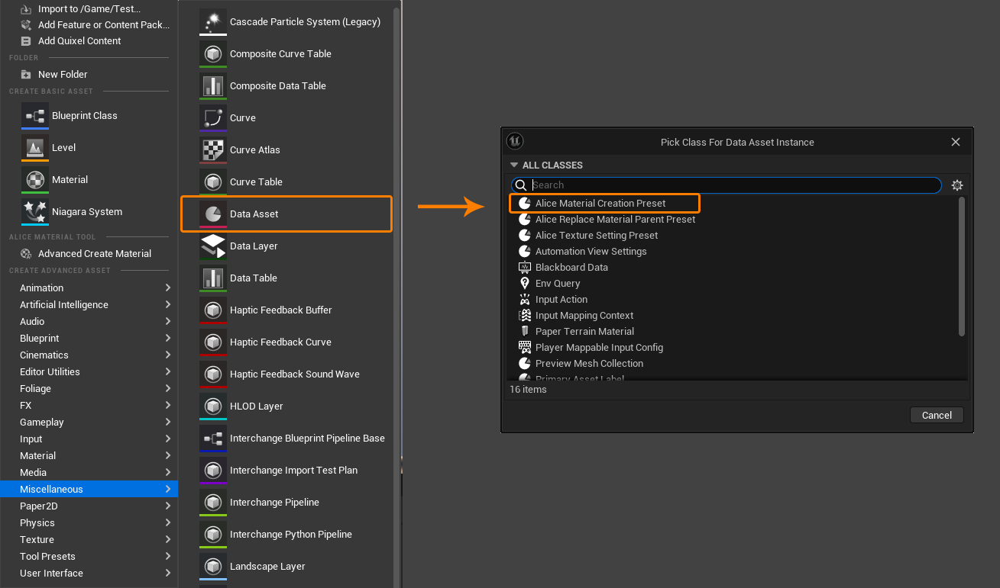

在 Material Creation Preset 中，可以设置这个 Material Creation Preset 所对应的 “Target Material”，如果为空，则表示这个 Material Creation Preset 可对应于所有 Material。

同一个 “Texture Parameter Name” 可以对应多种不同的纹理后缀，当选中的某个纹理具有对应的后缀（在纹理名称中以“_”分隔的最右侧内容）时，会将其设置给纹理中对应的 TextureParameter，当有多个可用的纹理时，设置中排名靠前的对应纹理会获得优先权。

### Material Textures Config Panel

当材质实例创建完成后，可以选择打开材质纹理配置面板：

该面板会罗列出所有被选中的纹理，并提供一个二次配置材质 TextureParameter 的窗口，这对于某些复杂或特殊的情况很有用。

该面板也旨在提供一个快捷的材质创建方式，即使您不打算遵从任何 Material Creation Preset 配置。

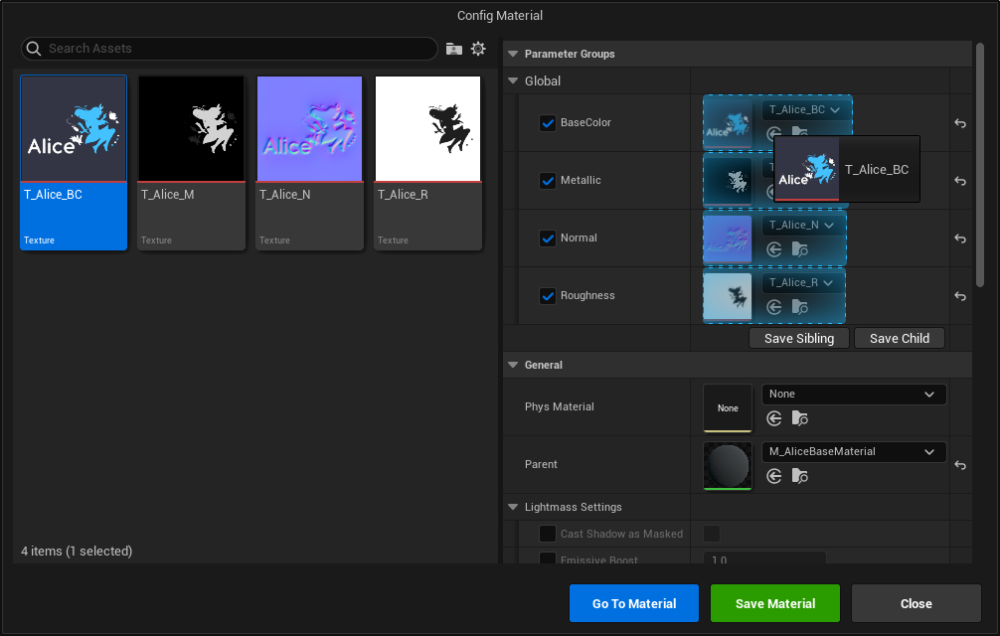

Material Textures Config Panel 是非模态的窗口，您可以从内容浏览器中拖拽其他未被选中的纹理来配置新生成的材质：

## Advanced Create Material - 蓝图工具

您可以在编辑器蓝图（非运行时蓝图）中调用与 Advanced Create Material 工具相同的功能，以程式化地批量生成材质实例。

要在编辑器蓝图中使用 Advanced Create Material，可以通过下面的节点：

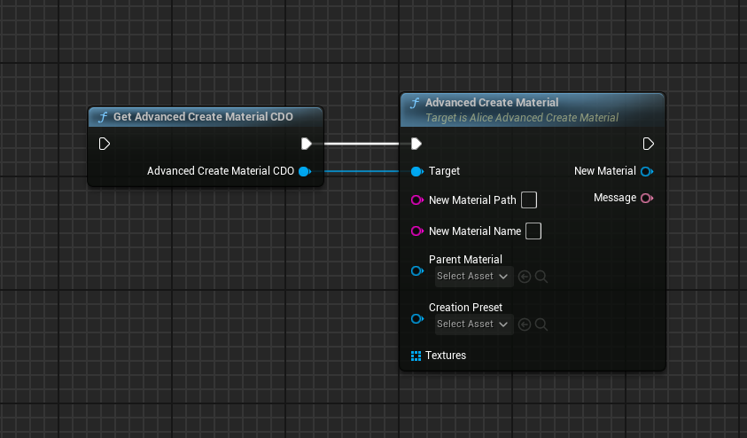

如果执行成功，“New Material” 输出Pin将输出新生成的材质实例指针，如果执行失败，“New Material” 输出Pin将输出空指针。无论执行成功或者失败，Message 输出Pin都将输出与之相应的消息。

# Advanced Replace Parent

Advanced Replace Parent 用于批量化地替换材质实例的父材质，并尽可能保留材质实例中的参数设置。

## Advanced Replace Parent - 编辑器工具

在内容浏览器中选择任意材质实例资产，单击右键打开资产上下文菜单，可以找到 Replace Parent 工具按钮。

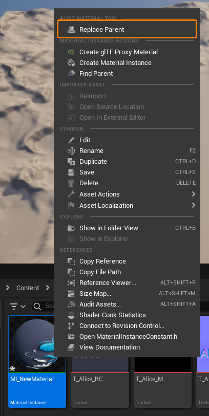

### 工具界面

点击“Replace Parent”按钮，将进入 Advanced Replace Parent 操作。此时会弹出一个设置对话框，该设置对话框是一个模态窗口，在进行 Advanced Replace Parent 操作的过程中，您将无法对内容浏览器中的其他内容进行编辑，直至材质实例的父材质替换完成，或本次操作被取消。设置对话框的UI看起来像下面这样：

1. **Parent Material Picker**
   Parent Material Picker 用于选取新的父材质，当本次 Advanced Replace Parent 操作成功时，工具会自动记录这一次替换操作使用的父材质，并在下一次打开工具后自动尝试选择该父材质作为默认父材质。
2. **Replace Material Parent Preset Picker**
   Replace Material Parent Preset 用于指导如何将旧的父材质参数传递给新的父材质参数。当本次 Advanced Replace Parent 操作成功时，工具会自动记录这一次创建操作使用的 Replace Material Parent Preset，并在下一次打开工具后自动尝试选择该 Replace Material Parent Preset 作为默认 Preset。
3. **Replace Material Parent Preset View**
   Replace Material Parent Preset View 用于预览选定 Replace Material Parent Preset 里的内容。
4. **Message Box**
   当操作不符合要求时，在此处会显示提示信息，此时右下角的 “Replace Parent” 按钮将变成灰色的不可用状态。当 Advanced Replace Parent 工具已经准备好替换材质实例的父材质时，此处将显示替换相关的简略信息，此时右下角的 “Replace Parent” 按钮将变成蓝色的可用状态。
5. **Setting**
   在成功替换材质实例的父材质后，Advanced Replace Parent 工具允许用户执行一些附加操作：
   - **Save material after replace parent -** 在替换父材质完毕后保存该材质实例。

*您可以一次性选择多个材质实例执行替换操作。当新的父材质与当前材质实例相同，或与当前材质实例的父材质相同时，Advanced Replace Parent 工具会跳过该材质实例的替换操作。*

### Replace Material Parent Preset

要创建 Replace Material Parent Preset，可以通过在内容浏览器中单击鼠标右键选择 Miscellaneous -> Data Asset，选择 “Alice Replace Material Parent Preset”。

在 Replace Material Parent Preset 中，可以成对地设置旧父材质 Parameter 和新父材质 Parameter 的名称对，Advanced Replace Parent 工具将根据这些名称对尝试在旧新材质之间传递参数。

原则上，旧父材质的 Parameter 可以反复向新父材质的不同 Parameter 传递参数。反之，如果有多个旧父材质的 Parameter 向同一个新父材质的 Parameter传递参数，则排名靠前的设置有优先权。

## Advanced Replace Parent - 蓝图工具

您可以在编辑器蓝图（非运行时蓝图）中调用与 Advanced Replace Parent 工具相同的功能，以程式化地批量替换材质实例父材质。

要在编辑器蓝图中使用 Advanced Replace Parent，可以通过下面的节点：

如果执行成功，“Success” 输出true，如果执行失败，“Success” 输出false。无论执行成功或者失败，Message 输出Pin都将输出与之相应的消息。